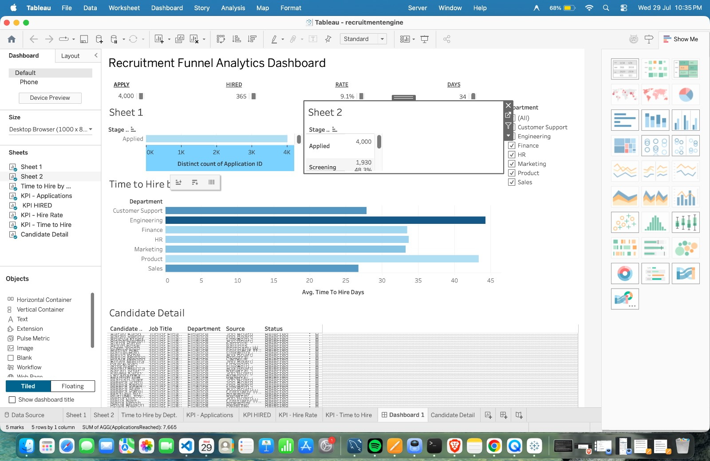

# Recruitment Funnel Analytics Dashboard

An interactive Tableau dashboard that tracks candidates through a 5-stage hiring pipeline, quantifies where the funnel leaks, and lets a hiring team drill from the aggregate funnel down to individual candidates.

Built with **Tableau** (data model, calculated fields, dashboard) and **Python** (synthetic data generation with pandas/numpy).

---

## What this project shows

- **Data modeling** — a star schema with one event fact table and six conformed dimensions.
- **Analytics** — stage-to-stage conversion and drop-off using LOOKUP table calculations, average time-to-hire, and headline KPIs.
- **Interactivity** — a department filter that controls the entire dashboard, plus a click-to-drill-down from the funnel to a candidate-level detail table.

---

## The data model (star schema)

The dataset is split into fact and dimension tables so descriptive values are stored once and referenced by key.

| Table | Grain (one row = ) | Role |
|-------|--------------------|------|
| `FactPipeline.csv` | one application × stage reached | **Fact** |
| `DimApplication.csv` | one application | Dimension |
| `DimCandidate.csv` | one candidate | Dimension |
| `DimJobRole.csv` | one job role | Dimension |
| `DimDepartment.csv` | one department | Dimension |
| `DimSource.csv` | one hiring channel | Dimension |
| `DimStage.csv` | one pipeline stage | Dimension |

**Relationships:** FactPipeline → DimApplication (ApplicationID) and → DimStage (StageKey); DimApplication → DimCandidate, DimJobRole, DimSource; DimJobRole → DimDepartment.

The fact table's grain — **one row per application per stage reached** — is chosen deliberately so the funnel is a simple `COUNTD(ApplicationID)` per stage, and the count naturally shrinks down the pipeline.

---

## Key metrics (calculated fields)

- **Applications Reached** — `COUNTD([Application ID])`, the funnel value.
- **Stage Conversion %** — `ZN([ApplicationsReached]) / LOOKUP(ZN([ApplicationsReached]), -1)` — a table calculation comparing each stage to the one above it.
- **Drop-off %** — `1 - [Stage Conversion %]`.
- **Overall Hire Rate %**, **Total Hired**, **Avg Time to Hire (days)**.

---

## Findings

The funnel loses roughly **half of the remaining candidates at every stage** from screening onward (drop-off ≈ 52%, 51%, 54%), but **~85% of offers are accepted**. So the organisation is excellent at *closing* the candidates it wants — the bottleneck is upstream, in sourcing and screening, not in the offer stage. Time-to-hire is highest in Engineering and Product (~35–44 days) and lowest in Sales and Support (~27 days).

| Stage | Reached | Conversion | Drop-off |
|-------|---------|------------|----------|
| Applied | 4,000 | — | — |
| Screening | 1,930 | 48.3% | 51.8% |
| Interview | 938 | 48.6% | 51.4% |
| Offer | 432 | 46.1% | 53.9% |
| Hired | 365 | 84.5% | 15.5% |

---

## Files in this repo

- `dashboard.png` — screenshot of the finished dashboard
- `recruitmentengine.twb` — the Tableau workbook (open in Tableau Public / Desktop)
- `*.csv` — the seven data files (star schema)
- `generate_data.py` — Python script used to create the synthetic dataset *(optional to include)*

---

## How to run it

1. Install [Tableau Public](https://public.tableau.com) (free).
2. Open `recruitmentengine.twb`, or connect to `FactPipeline.csv` and add the other CSVs, matching the keys in the table above.
3. Explore: click a funnel stage to drill into candidates; use the Department filter to re-slice the whole dashboard.

---

## Notes

The data is **synthetic**, generated in Python to model realistic recruitment-funnel behaviour (department-specific conversion rates and time-to-hire). No real candidate data is used.
